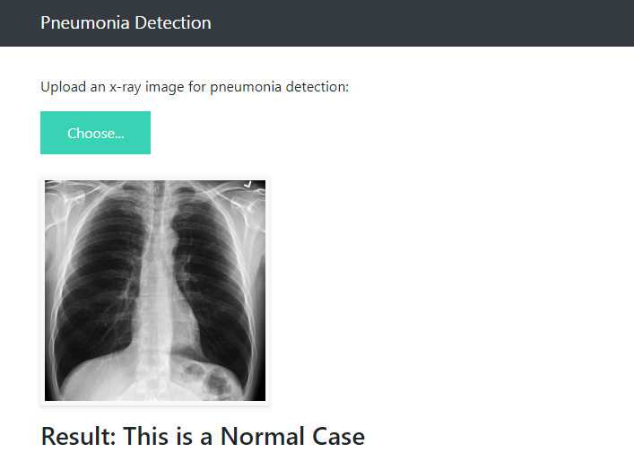

# Pneumonia Detection from x-ray images.

In this repo , I'll use x-ray images to detect pneumonia from them using fine-tuned VGG-16. This system when optimized could be used to assist radiologists. My optimization goal for this problem is to reduce the number of false negatives produced by the model i.e.the number of people with pneumonia diagnosed as normal. This objective is achieved while also keeping the False Positives low.

The datset is taken from Kaggle and is Imbalanced, which I've dealt with in all possible ways.

## Preprocessing
The images are of varying length and width and are all resized to 224X224 , all black and whites converted to RGBs, normalized the pixels, segementation all so proves to be useful for the model in simplifying the image.
Since, we have imbalanced data the most important preprocessing step is Image augmentation which I have done using *imgaug*.

## Training
For Training I've used pretrained VGG-16, frozen the initial layers, that learn abstract features and retrained the top most layers, to fit our data. I've trained the model for 5 epochs.

## Evaluation 
The model's performance is evaluated on test data and accuracy is not a trustworthy measure since the data is Imabalanced, so we use precision and recall instead.Since there is a trade-off between precision and recall , which means one increases at the cost of other , our main motive will be to have a high recall for our model and a relatively low but good precision as well.

## Class activation maps
Next, I've used class activation map to make the model more interpretable. 
The output is a heatmap showing, which areas of the image were used by the model to classify it as pneumonia.

# Deployment 
The deployment is very basic and I've used Flask for it. Save the model weights in 'models' ,run the app.py file and go to [ http://localhost:5000](http://localhost:5000). Upload the x-ray image of your choice and give it to the model to predict it

